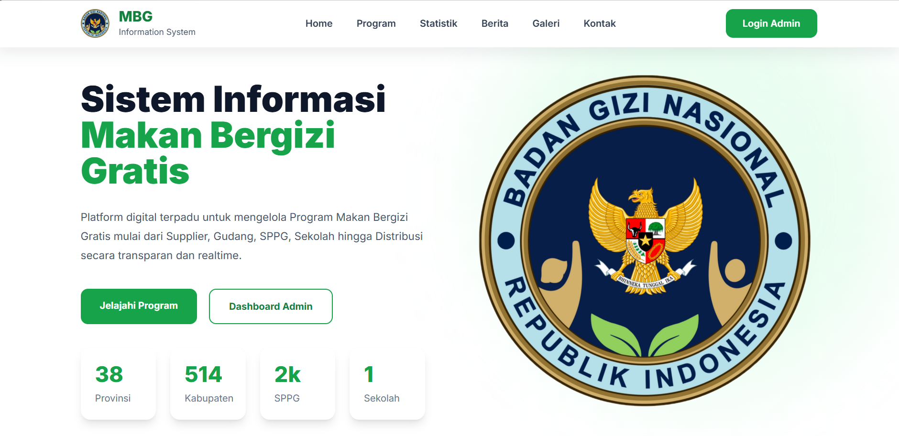
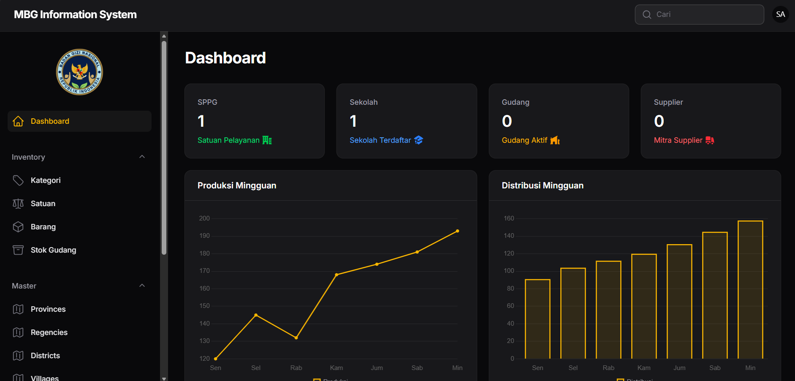
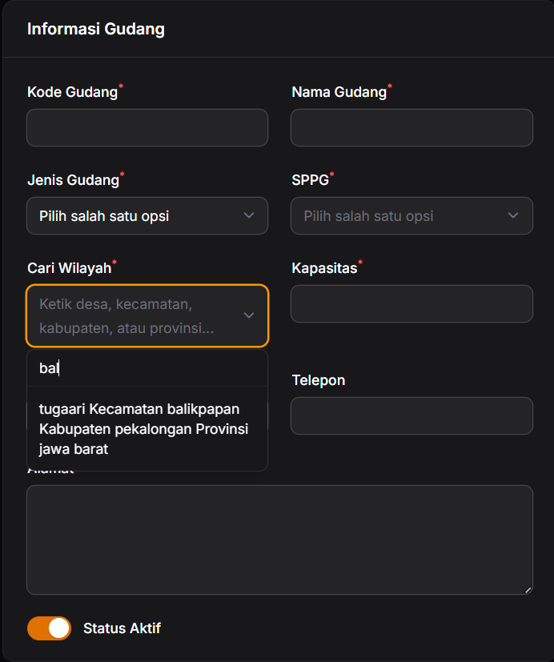
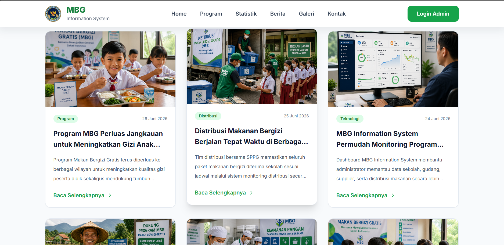

<div align="center">

# 🍽️ MBG Information System

### Monitoring Program Makan Bergizi Gratis

Sistem Informasi Monitoring Program Makan Bergizi Gratis berbasis Laravel 12 dan Filament Admin.


<br>


</div>

---

# 📖 About

MBG Information System merupakan sistem informasi yang digunakan untuk membantu proses monitoring Program Makan Bergizi Gratis (MBG).

Sistem menyediakan dashboard monitoring secara realtime untuk:

- Monitoring SPPG
- Monitoring Sekolah
- Monitoring Gudang
- Monitoring Supplier
- Monitoring Distribusi
- Monitoring Produksi
- Dashboard Statistik

---

# ✨ Features

## Landing Page

- Hero
- About
- Statistics
- Monitoring
- News
- Gallery
- Contact

---

## Dashboard

- Dashboard Modern
- Statistics Overview
- Production Chart
- Distribution Chart

---

## Inventory

- Barang
- Kategori
- Satuan
- Gudang
- Stok Gudang

---

## Master

- Provinsi
- Kabupaten
- Kecamatan
- Desa
- SPPG
- Sekolah
- Supplier

---

## IAM

- User
- Role
- Permission

---

# 📷 Screenshots

## Landing Page



---

## Dashboard



---

## Monitoring



---

## News



---

# 🛠 Tech Stack

| Technology | Version |
|------------|---------|
| Laravel | 12 |
| PHP | 8.2+ |
| Filament | v5 |
| MySQL | Latest |
| Tailwind CSS | Latest |
| Vite | Latest |

---

# 📂 Project Structure

```
app
 ├── Filament
 │   ├── Pages
 │   ├── Resources
 │   ├── Widgets
 │
 ├── Models
 ├── Providers

resources
 ├── css
 ├── js
 └── views

public
 ├── images
 └── storage
```

---

# 🚀 Installation

## 1 Clone Repository

```bash
git clone https://github.com/USERNAME/mbg-information-system.git
```

---

## 2 Masuk Folder

```bash
cd mbg-information-system
```

---

## 3 Install Dependency

```bash
composer install
```

---

## 4 Install Node Modules

```bash
npm install
```

---

## 5 Copy Environment

```bash
cp .env.example .env
```

Windows

```bash
copy .env.example .env
```

---

## 6 Generate Key

```bash
php artisan key:generate
```

---

## 7 Konfigurasi Database

```
DB_CONNECTION=mysql
DB_HOST=127.0.0.1
DB_PORT=3306
DB_DATABASE=mbg_information_system
DB_USERNAME=root
DB_PASSWORD=
```

---

## 8 Jalankan Migration

```bash
php artisan migrate
```

atau

```bash
php artisan migrate --seed
```

---

## 9 Jalankan Vite

```bash
npm run dev
```

---

## 10 Jalankan Server

```bash
php artisan serve
```

Aplikasi dapat diakses melalui

```
http://127.0.0.1:8000
```

Admin

```
http://127.0.0.1:8000/admin
```

---

# 🔐 Default Login

```
Email xxx

admin@mbg.local

Password xxx

password
```

---

# 📊 Dashboard Preview

Dashboard menampilkan:

- Total SPPG
- Total Sekolah
- Total Gudang
- Total Supplier
- Grafik Produksi
- Grafik Distribusi
- Monitoring Realtime

---

# 🎯 Roadmap

- ✅ Landing Page
- ✅ Dashboard
- ✅ Inventory
- ✅ Master Data
- ✅ Authentication
- ✅ News
- ✅ Gallery
- 🔄 Export PDF
- 🔄 Export Excel
- 🔄 Notification
- 🔄 API

---

# 👨‍💻 Author

## M. Riduwan

Program Studi Informatika

Universitas Baturaja

---

# 📄 License

MIT License
